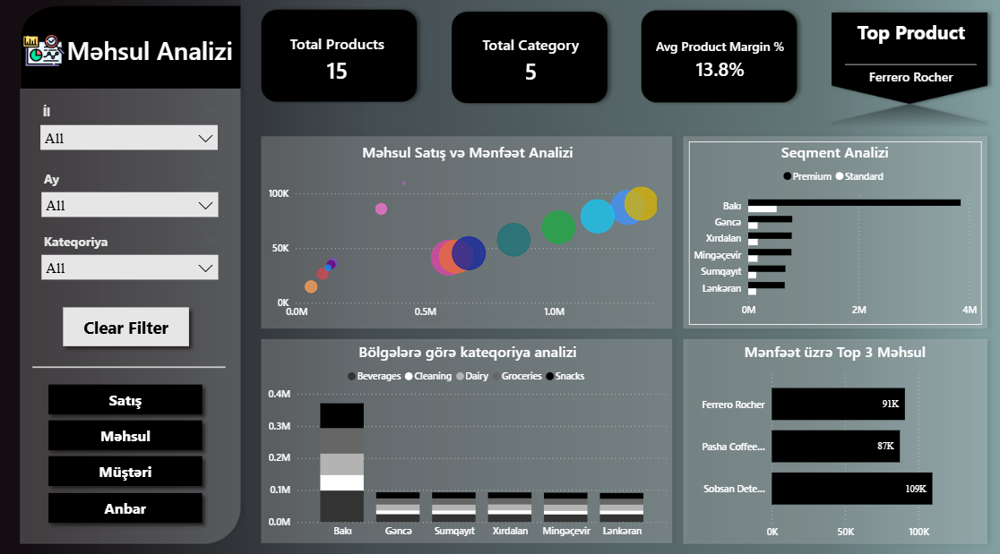
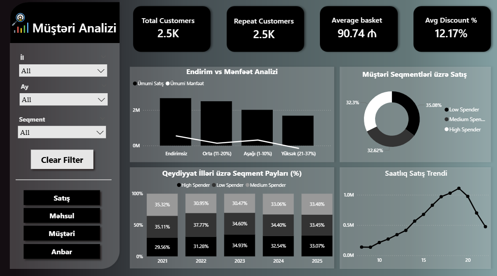
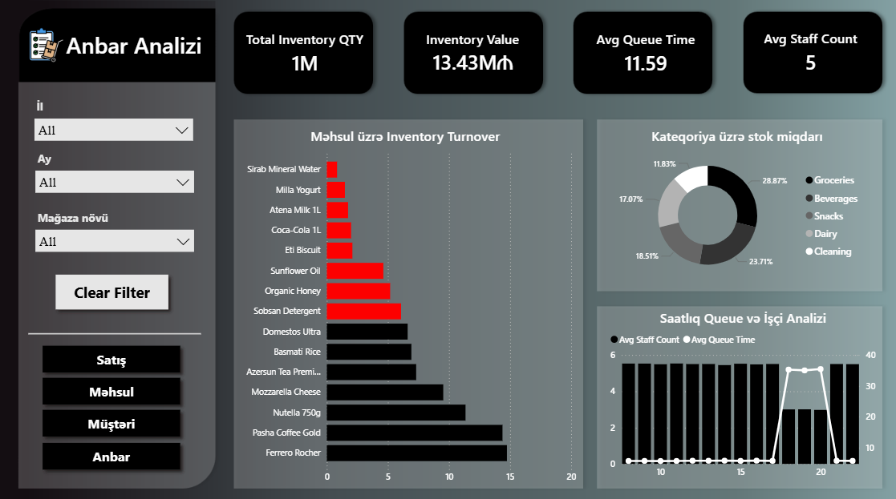

# Sales Analysis Dashboard | Power BI

An interactive sales analytics dashboard built in Power BI to analyze sales performance, profitability, products, customers, and warehouse operations.

## 📊 Project Overview

This project focuses on transforming raw sales data into an interactive business intelligence dashboard.

The goal was to explore sales performance from different perspectives and provide clear insights into revenue, costs, profit, customers, products, and store performance.

The dashboard was built from scratch using Power BI, with data transformation performed in Power Query, calculations created with DAX, and relationships structured through data modeling.

## 🎯 Business Questions

The dashboard was designed to answer questions such as:

- How are sales and profit changing over time?
- Which stores generate the highest sales?
- Which products contribute most to overall performance?
- How do customers differ in their purchasing behavior?
- How does discounting affect profitability?
- How does actual profit compare with the target?
- Which warehouses and product categories perform better?

## 🛠️ Tools & Technologies

- Power BI
- Power Query
- DAX
- Data Modeling
- Excel

## 📈 Dashboard Pages

### 1. Sales Analysis
- Total Sales
- Total Cost
- Total Orders
- Profit %
- Gross Sales
- Discount Impact
- Cost of Goods Sold
- Net Profit
- Top 5 Stores
- Monthly Profit Trend
- Target vs Actual Profit

### 2. Product Analysis
Analysis of product-level performance and sales trends.

### 3. Customer Analysis
Analysis of customer purchasing behavior and sales contribution.

### 4. Warehouse Analysis
Comparison of warehouse performance and sales distribution.

### 5. Tooltip
Additional contextual information displayed through interactive Power BI tooltips.

### 6. Drill Through
Detailed analysis of selected entities using Power BI drill-through functionality.

## 🔍 Key Features

- Interactive slicers for country, month, and product type
- Dynamic filtering
- Drill-through analysis
- Custom DAX measures
- KPI cards
- Profitability analysis
- Top 5 store ranking
- Target vs actual analysis
- Interactive tooltips

## 📸 Dashboard Preview

### Sales Analysis

### Product Analysis

### Customer Analysis

### Warehouse Analysis

## 📂 Project Files

- `sales_dashboard.pbix` — Power BI dashboard
- `data/` — Source dataset
- `images/` — Dashboard screenshots

## 💡 What I Practiced

Through this project, I practiced:

- Data cleaning and transformation with Power Query
- Building relationships between tables
- Creating calculated measures with DAX
- Designing interactive dashboards
- KPI development
- Business-oriented data analysis
- Turning raw data into actionable visual insights

## 🚀 Future Improvements

Possible future improvements include:

- Adding more advanced customer segmentation
- Expanding time-series analysis
- Adding additional profitability metrics
- Creating more detailed product and store comparisons
- Connecting the dashboard to a live data source

> Note: Dashboard labels are in Azerbaijani, as this was built for a local business context.

## 📌 Project Status

Completed
