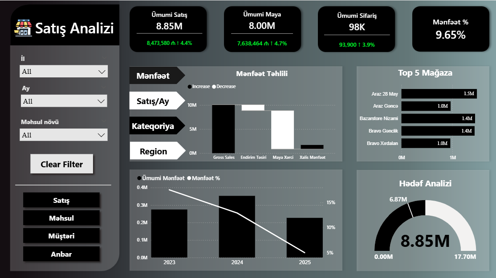

# Sales Analysis Dashboard (Power BI)

Interactive 6-page sales analytics dashboard built from scratch in Power BI,
covering sales, product, customer, and warehouse data.

## Features
- Dynamic filters (country, month, product type)
- Drill-through pages for deeper analysis
- DAX-calculated KPIs: Total Sales, Total Cost, Total Orders, Profit %
- Profit analysis with gross sales, discount impact, cost of goods, net profit
- Top 5 stores ranking
- Target analysis gauge with monthly profit trend

## Pages
1. Sales — KPI cards, profit analysis, top stores, target gauge
2. Product
3. Customer
4. Warehouse
5. Tooltip
6. Drill Through

## Tools
Power BI (Power Query, DAX, data modeling)

## Preview

